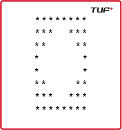

# ⭐ Pattern 19 - Double Triangle with Space in Middle

This pattern prints a **symmetric hourglass**-like structure made of stars `*` and spaces, consisting of two parts:

1. An **inverted pyramid** followed by a **normal pyramid** with increasing center spaces.
2. A **normal pyramid** followed by a **mirrored pyramid** with decreasing center spaces.

---

## 📌 Pattern Description (for `n = 5`)



## 🧠 Logic Breakdown

### ✅ Upper Half (First `for` loop)

```python
for i in range(n):
    for j in range(n - i):
        print("*", end="")             # Left triangle
    for spaces in range(2 * i):
        print(" ", end="")             # Center increasing spaces
    for stars in range(n - i):
        print("*", end="")             # Right triangle
````

* Left and right stars: `n - i` stars
* Spaces: `2 * i` (0, 2, 4, ..., 8)
* Total lines: `n`

### ✅ Lower Half (Second `for` loop)

```python
for i in range(n):
    for j in range(0, i + 1):
        print("*", end="")             # Left triangle (increasing)
    for spaces in range(2 * n - 2 * (i + 1)):
        print(" ", end="")             # Center decreasing spaces
    for stars in range(0, i + 1):
        print("*", end="")             # Right triangle (increasing)
```

* Left and right stars: `i + 1`
* Spaces: `2 * n - 2 * (i + 1)`

  * For `i = 0` → 8 spaces
  * For `i = 1` → 6 spaces
  * ...
* Total lines: `n`

---

## 🧪 Output for `n = 5`

```
**********
****  ****
***    ***
**      **
*        *
*        *
**      **
***    ***
****  ****
**********
```

* First 5 rows = Inverted triangle shrinking
* Next 5 rows = Normal triangle expanding
* Symmetrical around the center line

---

## 📂 File Structure

```
📁 Patterns
 ┗ 📄 Pattern19.py
 ┗ 📄 README.md
```

---

## ✅ Usage

Run the code using:

```bash
python Pattern19.py
```

Edit `n` in `solution.Pattern19(n)` to generate different sizes.

---

*This pattern is useful for understanding symmetric structure building, nested loops, and space management in pattern problems.*
