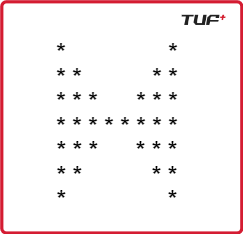

# ⭐ Pattern 20 - Double Pyramid with Mirrored Hourglass

This pattern prints a **mirrored diamond-like shape** made of stars (`*`) and spaces. It is structured in **two main parts**:

1. **Top Half**: Expanding pyramids with decreasing center spaces.
2. **Bottom Half**: Shrinking pyramids with increasing center spaces.

---

## 📌 Pattern Output for `n = 4`



- The pattern is **symmetric** vertically.
- The number of stars on each side increases (top) then decreases (bottom).
- The number of spaces in the center shrinks (top) and then grows (bottom).

---

## 🧠 Logic Breakdown

### ✅ Top Half (Lines 1 to `n`)

```python
initial_spaces = 2 * n - 2
for i in range(1, n + 1):
    print("*" * i, end="")               # Left stars
    print(" " * initial_spaces, end="")  # Middle spaces
    print("*" * i, end="")               # Right stars
    print()
    initial_spaces -= 2                 # Reduce spaces for next line
```

* Starts with 2n - 2 spaces.

* Each row:

  * Increases stars by 1 on both sides

  * Decreases center space by 2

### ✅ Bottom Half (Lines n+1 to 2n - 1)
```
initial_spaces = 2
for i in range(1, n):
    print("*" * (n - i), end="")         # Left stars (decreasing)
    print(" " * initial_spaces, end="")  # Middle spaces
    print("*" * (n - i), end="")         # Right stars
    print()
    initial_spaces += 2                 # Increase spaces for next line
```

* Starts with 2 spaces, increasing by 2 each row

* Stars reduce from n-1 down to 1 on both sides

# 📂 File Structure Suggestion
```
📁 Patterns
 ┗ 📄 pattern20.py
 ┗ 📄 README.md

```
